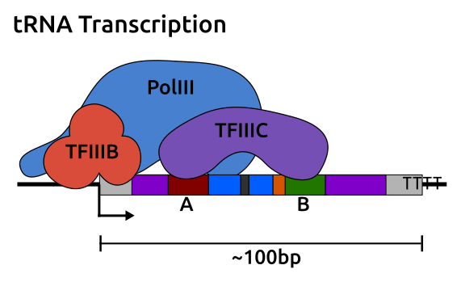
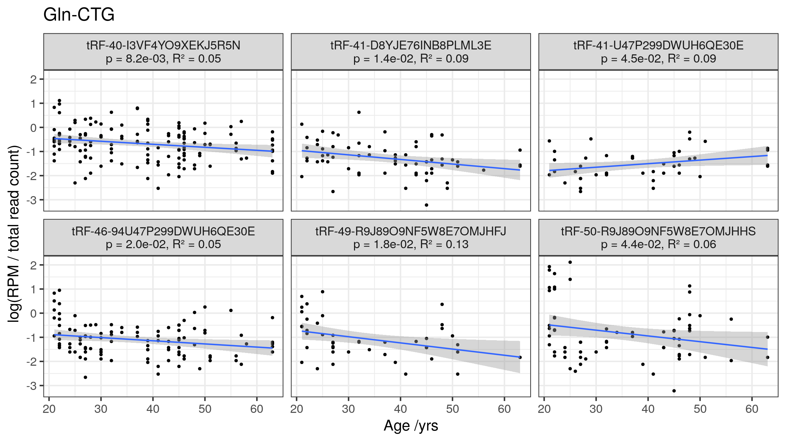

```{r, echo=FALSE,include=FALSE}
suppressPackageStartupMessages({
	library(dplyr)
	library(ggplot2)
	library(readr)
	library(plotly)
	library(kableExtra)
	library(emo)
	library(qrcode)
})
```

# Ageing

## Burden of Age-related Disease

Ageing is the major risk factor for

- Cancer
- Heart Disease
- Dementia
- Type 2 Diabetes
- Other Chronic Diseases

$\therefore$ 

Understanding Ageing

- $\uparrow$ Healthspan / $\downarrow$ Morbidity
- $\downarrow$ Age-related Diseases

<section data-notes="
	- Healthspan - Living longer but chronic conditions
	- Eliminating any one of these minimal impact on average lifespan
	- Frailty ~
"></section>

## Multisystem Nature of Ageing

Epigenetics - Hub of the Hallmarks of Ageing

```{r, out.width='50%', fig.show='hold', fig.align = 'center', echo=FALSE}
knitr::include_graphics("./graphics/Booth2016_F3_epigenomeHubAgingHallmarks.png")
```

<small>Booth & Brunet 2016 *MolCell* [@Booth2016]</small>

Loss of epigenetic information $\rightarrow$ Dysregulation

<section data-notes="
	- loss of epigenetic information -> Dysregulation
"></section>

## DNA methylation changes with Age

- 1,000s of Loci Affected
- Global Hypomethylation
	- Demethylation of Repetitive elements
	- Some regions hypermethylating
- Increased Variability
- Changes enriched in functional elements
	- Enhancers & Promoters

## Epigenetic Clocks

Epigenetic Changes Capture Biological Ageing

```{r, out.width='40%', fig.show='hold', fig.align = 'center', echo=FALSE}

```

Survival is better in those with decelerated DNAm Age

<small>Horvath 2013 *Genome Biol* [@Horvath2013], Marioni et al. 2015 *Genome Biol* [@Marioni2015]</small>

# Why Transfer RNAs (tRNAs)?

- Bell et al. 2016 *Genome Biol* [@Bell2016]
- 71 age differentially methylated regions
	- 39 $\uparrow$, 32 $\downarrow$
- tRNA-iMet-CAT-1-4 DNAm $\uparrow$ with Age

```{r, out.width='90%', fig.show='hold', fig.align = 'center', echo=FALSE}
knitr::include_graphics("./graphics/Bell2016_GenBio_FigS1p55_tRNAMet_a-DMR.png")
```

# Why Transfer RNAs (tRNAs)? {data-transition="none"}

- Bell et al. 2016 *Genome Biol* [@Bell2016]
- 71 age differentially methylated regions
	- 39 $\uparrow$, 32 $\downarrow$
- tRNA-iMet-CAT-1-4 DNAm $\uparrow$ with Age

```{r, out.width='90%', fig.show='hold', fig.align = 'center', echo=FALSE}
knitr::include_graphics("./graphics/Bell2016_GenBio_FigS1p55_tRNAMet_a-DMR_circle.png")
```

## tRNAs

```{r, out.width='50%', fig.show='hold', fig.align = 'center', echo=FALSE}
knitr::include_graphics("./graphics/translation5.gif")
```

Fundamental to the information flow from DNA to Protein

## Extra-translatory Role

```{r, out.width='55%', fig.show='hold', fig.align = 'center', echo=FALSE}
knitr::include_graphics("./graphics/tRNAderivedSmallRNARoles.png")
```

$+$ internal tRNA fragments & piRNAs

## tRNA expression

- tRNA genes act as insulators <small>(Raab et al. 2011 *EMBO* [@Raab2011])</small>
- Clustered with other tRNA genes in 3D <small>(VanBortle et al. 2017 *Genome Biol* [@VanBortle2017])</small>
- RNA polymerase III <small>(Schramm & Hernandez 2002 *Genes & Dev* [@Schramm2002])</small>
- Internal Promoter Structure
- Experimentally DNAm $\uparrow\ \rightarrow$ tRNA Expression $\downarrow$ <small>Besser et al. 1990 *FEBS letters* [@Besser1990]</small>

```{r out.width='50%', fig.show='hold', fig.align = 'center', echo=FALSE}

```

## tRNAs in Ageing

- $\downarrow$ Translation, $\uparrow$ Longevity <small>(Hansen et al. 2007 *Aging Cell*[@Hansen2007])</small>
- Ageing ~ TORC1 $\dashv$ Maf1 $\dashv$ polIII $\dashv$ tRNA expression
- $\downarrow$ polIII, $\uparrow$ Longevity <small>(Filer et al. 2017 *Nature* [@Filer2017])</small>
- Circulating tRNA halves modulated by ageing and calorie restriction <small>(Dhahbi et al. 2013 *BMC Genomics*[@Dhahbi2013])</small>
- tsRNAs in stress response & Translational regulation
- __tRNA biology is intimately connected with many systems which modulate ageing__

## Human tRNAome

- Up to 610 tRNA genes <small>Chan 2009 *NAR* [@Chan2009]</small>
- median length 73bp
- <46kb, 0.002% of the Genome
- 2nd most abundant RNA species, ~60 million/cell

<br>

```{r, echo=FALSE, warning=FALSE, message=FALSE, out.width='85%', fig.show='hold', fig.align = 'center'}
tRNAs <- read_tsv(
	"~/Documents/PhD_Stuff/phd/Projects/tRNA_Stuff/tRNA-GtRNAdb/hg19-tRNAs.bed",
	col_types = cols(.default = col_character()),
	col_names = colnames(read_tsv(
		"~/Documents/PhD_Stuff/phd/Projects/tRNA_Stuff/tRNA-GtRNAdb/std_tRNA_header.txt",
		col_names = TRUE,
		col_types = cols(.default = col_character())
	))
)

tRNAs %>%
	group_by(tChr) %>%
	summarize(count = n()) %>%
	plot_ly(
		labels = ~tChr, values = ~count,
		width = 800, height = 400
	) %>%
	add_pie(hole = 0.6) %>%
	layout(
		margin = list(t = 50),
		title = "Proportion of tRNAs By Chromosome",  showlegend = TRUE,
		xaxis = list(
			showgrid = FALSE, zeroline = FALSE, showticklabels = FALSE
		),
		yaxis = list(
			showgrid = FALSE, zeroline = FALSE, showticklabels = FALSE
		)
	)
```

<section data-notes="
	- 23 nuclear encoded mitochondrial tRNAs
	- 116 potential pseudogenes
	- 107 are in blacklisted regions
	- 7 of the 61 non-STOP codons are missing - wobble pairing
		- (*e.g.* GCG Arg, ACC Gly)
"></section>

## Isodecoders

- tRNA with the same anticodon but different sequence elsewhere
- Numbers increase with organismal complexity <small>(Goodenbour et al. 2006 *NAR* [@Goodenbour2006])</small>
- Non-equivalent translational efficiency <small>(Geslain et al. 2010 *J Mol Biol* [@Geslain2010])</small>

```{r out.width='20%', fig.show='hold', fig.align = 'center', echo=FALSE}

```

## tRNA gene Copy Number

```{r, out.width='85%', fig.show='hold', fig.align = 'center', echo=FALSE}
knitr::include_graphics("./graphics/kutteresq_BLcount.png")
```

() = pseudo genes, [] = in blacklisted regions

## tRNAs & Disease

- Synonymous CFTR mutation to low abundance tRNA causes misfolding <small>(Kirchner et al. 2017 *PLoS Bio* [@Kirchner2017])</small>
- tRNA fragments implicated in neuro-developmental disorders <small>(Blanco et al. 2014 *EMBO* [@Blanco2014])</small>


# Results

## Twins UK MeDIP-seq Data

- 4350 DNA methylomes (Whole Blood)
- 3001 with Cell-type counts
- 16 - 82 yrs
- Sequencing based technology
	- 50bp reads, 200-500bp fragments
	- Good Coverage but limited positional resolution
	
<small>Bell et al. 2017 *Nat Comm* [@Bell2017a] </small>

```{r out.width='35%', fig.show='hold', fig.align = 'center', echo=FALSE}
knitr::include_graphics(
	c(
		"./graphics/chip-seq.jpeg",
		"./graphics/500bpwindowsing_bg.png"
	)
)
```

<section data-notes="
	- Quantile normalised RPM
"></section>

## Mappability

```{r out.width='65%', fig.show='hold', fig.align = 'center', echo=FALSE}
knitr::include_graphics("./graphics/mappabilityScoreDensity_tRNAVsFlank500.png")
```

## Age-related DNA hypermethyation

- tRNAome-wide significant (p < $8.36\times10^{-5}$)
	- Batch corrected 
		- __44__ $\uparrow$, $\downarrow$ 0
	- Batch and Blood Cell-type corrected 
		- __16__ $\uparrow$, $\downarrow$ 0
- Genome-wide significant (p < $4.34\times10^{-9}$)
	- 3 Batch and Blood Cell-type corrected

<br>

```{r, out.width='60%', echo=FALSE,}
bb6tRNASummaryTab <- read_tsv(
	"./data/bb3tRNASummaryTab.tsv",
	progress = FALSE,
	col_types = cols(
		.default = col_character()
	)
)

bb6tRNASummaryTabKable <- 
bb6tRNASummaryTab %>% 
	select(-`BiS-seq p-value`, -`BiS-seq slope`) %>%
	kable(
		#digits = 2,
		format = "html",#"latex",
		escape = FALSE,
		booktabs = TRUE,
		#caption = "(ref:GWSBBtRNAsTabCap)",
		linesep = ""
	) %>%
	kable_styling(
		bootstrap_options = "striped", full_width = FALSE,
		latex_options = c("striped", "scale_down")
	) %>%#, fixed_thead = TRUE
	#row_spec(0, background = "#b8b8b8") %>%
	column_spec(1, bold = TRUE, border_right = TRUE)

bb6tRNASummaryTabKable
```

<section data-notes="
	- Ill-AAT-4-1 & Ser-AGA-2-6 3' UTR of CTC1 (CST Telomere Replication Complex Component 1)
"></section>

## Enrichment for DNA hypermethylation

```{r out.width='80%', fig.show='hold', fig.align = 'center', echo=FALSE}
knitr::include_graphics(
	"./graphics/nSigWinProps_WGfishers_BB_sws_hyper_2_BL_noPolyBivExcl_BarTxtast_sr.png"
)
```

## CpG Density Permutation

- Sampled windows with matching CpG density 

```{r out.width='75%', fig.show='hold', fig.align = 'center', echo=FALSE}
knitr::include_graphics(
	"./graphics/tRNA-poly-bivP_n1000_combined_perm_hist.png"
)
```

## MeDIP-seq limitations

- Regional
	- Good Coverage but limited positional resolution
- Imperfect methylation Quantitation (especially at low DNAm)

```{r out.width='25%', fig.show='hold', fig.align = 'center', echo=FALSE}
knitr::include_graphics("./graphics/chip-seq.jpeg")
```

## Neonate & Centenarian

- Whole genome Bisulfite Sequencing (WGBS)
- tRNA hypermethylation even between single individuals 

```{r out.width='45%', fig.show='hold', fig.align = 'center', echo=FALSE}
knitr::include_graphics("./graphics/heynViolinBBswsOnlyLabelled_BL.png")
```

## Validation in 450k array

- Good Methylation Quantitation
- CpG specific, probes within tRNA genes
- Covers 103 tRNAs, 7 of the 16 tRNAome significant
- 5 of these show an increase ($4.39\times10^{-4}$, N = 587)
- Cell-type corrected

```{r out.width='50%', fig.show='hold', fig.align = 'center', echo=FALSE}

```

## Targeted Bisulfite Sequencing (BiS-seq)

Pooled Samples approach (N = 190, ~25 per pool)

```{r poolAges, out.width='60%', echo=FALSE,eval=FALSE}
# poolColours <-c(
# 	"Pool 1"="#ffffcc","Pool 2"="#CCCC56",
# 	"Pool 3"="#a1dab4","Pool 4"="#3CA661",
# 	
# 	"Pool 5"="#41b6c4","Pool 6"="#2899A8",
# 	"Pool 7"="#225ea8","Pool 8"="#14488C"#,
# 	#"DNAm Age" = "red"
# )
# 
# read_tsv("./data/poolSummaries.tsv", col_types = "cdcddd") %>%
# 	mutate(
# 		Pool = cell_spec(
# 			Pool, "html",#"latex",
# 			# color = "#000000",
# 			align = "c"#,# angle = 45,
# 			# background = poolColours[Pool]
# 		)
# 	) %>%
# 	kable(
# 		digits = 2,
# 		format = "html",#"latex",
# 		escape = FALSE,
# 		booktabs = TRUE,
# 		#caption = "(ref:poolAgesCap)",
# 		linesep = ""
# 	) %>%
# 	kable_styling(
# 		bootstrap_options = "striped", full_width = FALSE,
# 		latex_options = "striped"
# 	) %>%#, fixed_thead = TRUE
# 	#row_spec(0, background = "#b8b8b8") %>%
# 	column_spec(1, bold = TRUE, border_right = TRUE)
# 
# #poolSummaryTable
```

```{r out.width='55%', fig.show='hold', fig.align = 'center', echo=FALSE}
knitr::include_graphics("./graphics/pooling.png")
```

## DNAmAge of Pooled Samples

DNAm age prediction to test pooling approach

```{r out.width='55%', fig.show='hold', fig.align = 'center', echo=FALSE}
knitr::include_graphics("./graphics/DNAmAgeVsChronAge.png")
```

<small>Horvath 2013 *Genome Biol* [@Horvath2013]</small>

## Targeted (BiS-seq) Results

- 79 tRNA loci
- Differences between Duplicates / Isodecoders

```{r out.width='85%', fig.show='hold', fig.align = 'center', echo=FALSE}

```

## tRNA-iMet-CAT-1-4 individual CpG Hypermethylation

```{r out.width='60%', fig.show='hold', fig.align = 'center', echo=FALSE}
knitr::include_graphics("./graphics/tRNA-iMet-CAT-1-4_nomSig_CpG.png")
```

## tRNA gene methylation by Cell-type 

- Sorted blood cell populations, 450k array <small>Reinius et al. 2012 *PLoS one* [@Reinius2012]</small>
- 8 study-wide significant tRNAs covered
- Collectively more methylated in lymphoid than myeloid lineage 
	- (1.1% difference, Wilcoxon rank sum test p = $1.50\times10^{-6}$)

$\therefore$ 

Age-related $\uparrow$ myeloid cell proportion $\rightarrow$ age-related hypermethylation $\downarrow$

```{r out.width='55%', fig.show='hold', fig.align = 'center', echo=FALSE}
knitr::include_graphics("./graphics/meanMethbytRNAMatLowBB6_bl.png")
```

## Mouse `r ji("mouse2")`

- Reduced Representation Bisulfite Sequencing (RRBS) 
- N = 152, Aged 0.67-35 months
- Covering 51 tRNAs (~11% of total) 
- 3 significant all $\uparrow$ (p < $1.08 \times 10^{-4}$)

```{r out.width='60%', fig.show='hold', fig.align = 'center', echo=FALSE}
knitr::include_graphics("./graphics/CpGPlotComb.png")
```

<small>Petkovich et al. 2017 *Cell Met* [@Petkovich2017]</small>

# Functional Consequences

## Chromatin State

Age hypermethylating tRNAs more Enhancer-like state (Enh, EnhBiv & EnhG) 
	- (Fisher's Exact test p = 0.01)

```{r out.width='65%', fig.show='hold', fig.align = 'center', echo=FALSE}

```

[Epilogos](https://epilogos.altius.org/) 'Blood & T-cell' 15 State model (tRNA genes +/- 200bp)

## Expression 

## MINTmap

- Exhaustive exact search of tRNA sequence space
- Small RNA-seq (read length = 50nt)
- combined data from Sorted blood cell types
- N = 42, aged 21 - 63 yrs
- Fragment length >40nt
- 5384 unique fragments derived from as many as 417 tRNA loci
- __Many-to-many tsRNA to tRNA gene mapping__

<small>
Loher et al. 2017 *Sci Repts* [@Loher2017], Juzenas et al. 2017 *NAR* [@Juzenas2017]
</small>

## MINTmap Results

- 48 tsRNAs with nominally significant expression changes (p < 0.05)
	- 8 $\uparrow$, 40 $\downarrow$ abundance with age
- tRNA-Gln-CTG-7-1 is in the 16 tRNAome-wide significant hypermethylators 

```{r out.width='65%', fig.show='hold', fig.align = 'center', echo=FALSE}

```

- Suggests age-related decline in Gln-CTG family tRNA expression

# Conclusions & Discussion

- The Human tRNAome is enriched for age related DNA hypermethylation
	- Some blood cell-type independent
	- Not driven by CpG density
- Validated select tRNAs in 450k array
- Replicated select tRNAs in Targeted BiS-seq
- Evidence of tRNA gene hypermethylation in mouse
- tRNA gene DNAm differences between blood cell-lineages
- tRNA are in early replicating regions
	- Possible reason for hypermethylation <small>(Muller & Nieduszynski 2017 *J Cell Biol*, [@Muller2017], Du et at. 2019 *Nat Comms* [@Du1029])</small>

# Current Work - Alu Clock

- Constructing a DNAm clock using Alu elements
- MeDIP-seq data coverage of regions not on the array
- Compare to other clocks
- GWAS for Alu Age acceleration

```{r, out.width='85%', fig.show='hold', fig.align = 'center', echo=FALSE}
knitr::include_graphics("./graphics/Alu_study_design_2019-12-05.png")
```

# Acknowledgements

```{r out.height='10%', echo=FALSE,}
dir("graphics", pattern = "_logo.png", full.names = TRUE) %>%
knitr::include_graphics()
```

- __Supervisors:__ Christopher G. Bell, Karen Lillicrop, Cyrus Cooper
- __MRC LEU:__ Elaine Dennison (Hertfordshire), Cyrus Cooper, Nicholas Harvey (MAVIDOS), Nikki Graham
- __Barts and the London:__ Charles Mein, Emma Bourne, Eva Wozniak
- __TwinsUK / KCL:__ Tim Spector, Pirro Hysi, Jordana Bell, Wei Yuan
- __BGI shenzen:__ Fei Gao, Yudong Xia, Jun Wang
- IRIDIS High-Performance Computing Facility
- __Funding:__ Medical Research Council

## Slides

Contact: <a href="mailto:r.j.acton@soton.ac.uk">r.j.acton@soton.ac.uk</a>

github: [richardjacton.github.io](http://richardjacton.github.io)

orcid: [0000-0002-2574-9611](https://orcid.org/0000-0002-2574-9611)

```{r, echo=FALSE, fig.align = 'center', fig.width=1.5, fig.height=1.5,dpi=96}
url <- "https://richardjacton.github.io/LEC-tRNA-presentation-2019-12-06/LEC-tRNA-presentation-2019-12-06.html"
par(mar = c(0, 0, 0, 0))
dataMasked <- qrcode_gen(url, dataOutput=TRUE, plotQRcode = FALSE)
heatmap(
	dataMasked[nrow(dataMasked):1,],
	Rowv = NA, Colv = NA,
	scale="none", col = c("white","black"),
	labRow = '',labCol = '',
	margins = c(0.1,0.1)
)
```

# References

---

<small><small><small>
<div id="refs"></div>
</small></small></small>

---


## Human tRNAome

```{r, out.width='85%', fig.show='hold', fig.align = 'center', echo=FALSE}
knitr::include_graphics("./graphics/kutteresq_BLcount.png")
```

() = pseudo genes, [] = in blacklisted regions

## tRNA modifications

- Most heavily modified RNA species
	- $>$ 100 different modifications
- 11-13 per tRNA molecule <small>(Schimmel 2017 *Nat Rev Mol Cell Biol* [@Schimmel2017])</small>

```{r, out.width='55%', fig.show='hold', fig.align = 'center', echo=FALSE}
#@Hopper2013
knitr::include_graphics("./graphics/tRNA_modifications_yeast.jpeg")
```


---

structure notes

- Why?
	- Ageing
	- epigenetics ~ ageing
	- prior tRNA result ~ artifact?
	- tRNA biology ~ ageing
		- tsRNAs
		- tRNA modifications
- What - Results
	- meDip
		- immunoprecipitation / regional
	- age related DNA hypermethylation
	- enrichment, CpG density permutation
	- array
		- bisulfite conversion based, highly quantitative
		- within the tRNA
	- Targeted
		- pooling
		- compare duplicates / isodecoders

